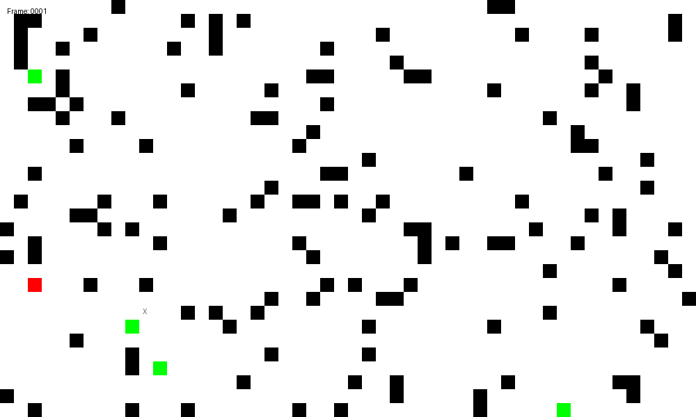

# 🚀 AeroSwarm - Parallel Drone Swarm Simulator

  <!-- Your generated GIF here -->

> **Note**: If the GIF doesn't animate on GitHub, refresh the page or view it [directly](docs/simulation.gif).

A high-performance C++ simulator for autonomous drone swarms with parallel pathfinding.


## ✨ Features
- **Parallelized terrain navigation** using `std::shared_mutex`
- **Obstacle avoidance** with probabilistic maps
- **Real-time visualization** (GIF generation)
- **Scalable architecture** for 1000+ drones

## 🛠️ Build
```bash
mkdir build && cd build
cmake ..
make
./AeroSwarm 
``` 

## 📊 Example Output
```
Iteration: 90
Iteration: 91
Iteration: 92
🎯 Drone #0 found the target at (20,2)
```

## 📜 License

MIT License - Free for research and commercial use.
