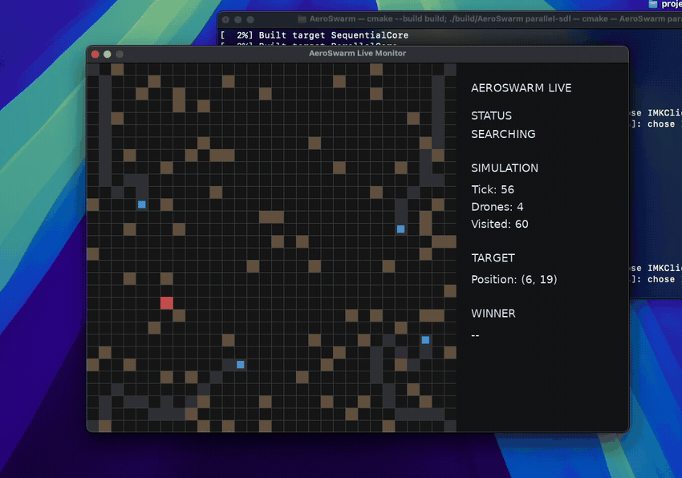

# 🚁 AeroSwarm

**Concurrent Multi-Drone Search Simulation with Real-Time SDL3 Visualization**

AeroSwarm is a modern C++ simulation project for exploring **concurrent agents, shared-state synchronization, search heuristics, deterministic scenario generation, and real-time visualization**.

Multiple autonomous drones explore a shared 2D environment containing obstacles and a target. The project provides both a **sequential reference implementation** and a **parallel multi-threaded implementation**, together with a live console monitor and an SDL3 graphical renderer.

## 🎬 Live Demo

<p align="center">
  
</p>

<p align="center">
  <sub>
    Parallel drone simulation with thread-safe snapshots and live SDL3 telemetry.
  </sub>
</p>

The current architecture deliberately separates:

- simulation logic,
- concurrency and synchronization,
- scenario generation,
- application runners,
- telemetry snapshots,
- and visualization.

This makes AeroSwarm useful not only as a drone-search simulation, but also as a compact example of the architecture behind real-time systems where a high-frequency producer generates state that is consumed independently by monitoring or visualization components.

---

## ✨ Features

### Simulation

- Sequential reference simulation
- Parallel multi-drone simulation
- Shared 2D terrain
- Obstacles
- Target detection
- Four-drone corner deployment
- Eight-direction movement
- Deterministic seeded scenarios
- Random target generation
- Random obstacle generation
- Global visited-cell tracking

### Search Strategy

Drone movement is not purely random.

The current exploration policy:

1. discovers currently available neighboring cells,
2. immediately prioritizes the target when it is adjacent,
3. evaluates candidate cells using **information gain**,
4. keeps candidates with the highest information gain,
5. randomly selects between equally ranked candidates.

This gives the drones a lightweight exploration heuristic while preserving some stochastic behavior.

### Concurrency

The parallel implementation demonstrates several C++ synchronization primitives:

- `std::thread`
- `std::atomic`
- `std::mutex`
- `std::shared_mutex`
- `std::lock_guard`
- `std::shared_lock`
- `std::unique_lock`

Shared terrain and drone state are protected explicitly, while atomic state is used for lightweight cross-thread signalling.

### Live Monitoring

AeroSwarm currently supports two live consumers:

- terminal-based live monitoring,
- SDL3 graphical visualization.

The simulation and renderer intentionally run at different frequencies:

```text
Simulation workers  ≈ 100 Hz
Renderer             ≈ 60 FPS
```

The renderer does **not** directly inspect mutable worker state.

Instead, it consumes a thread-safe `SimulationSnapshot`.

---

# 🖥️ Live Visualization

The SDL3 mode displays the simulation while the parallel workers are running.

The current visualization includes:

- terrain grid,
- drone positions,
- visited cells,
- obstacles,
- target location,
- live movement,
- final simulation state.

The visualization layer is intentionally independent from the simulation engine.

```text
┌───────────────────────────────────────────┐
│               SDL3 Renderer               │
│                  ~60 FPS                  │
└─────────────────────▲─────────────────────┘
                      │
                      │ SimulationSnapshot
                      │
┌─────────────────────┴─────────────────────┐
│          Parallel Simulation              │
│                                           │
│ Drone 1   Drone 2   Drone 3   Drone 4     │
│    │         │         │         │        │
│    └─────────┴────┬────┴─────────┘        │
│                   │                       │
│            Shared Terrain                 │
│                   │                       │
│         synchronized access               │
└───────────────────────────────────────────┘
```

A simulation update therefore does not imply a rendered frame.

For example:

```text
time (ms)      0    10    20    30    40    50    60

simulation     S     S     S     S     S     S     S
               └──────────── ~100 Hz ──────────────┘

renderer       R          R          R          R
               └──────────── ~60 FPS ─────────────┘
```

Some intermediate simulation states may never be rendered.

That is intentional.

The renderer only needs the **latest consistent state** when producing the next frame.

---

# 🧠 Exploration Algorithm

AeroSwarm uses a simple information-gain heuristic to reduce the probability that a drone immediately explores itself into a dead end.

For a candidate position:

```text
information_gain(position)
    =
number of currently available neighboring cells
```

A simplified decision flow is:

```text
             Current Position
                    │
                    ▼
          Find available neighbors
                    │
                    ▼
          Is target immediately
              reachable?
             /          \
           yes           no
            │             │
            ▼             ▼
       choose target   calculate
                      information gain
                           │
                           ▼
                    highest-gain cells
                           │
                           ▼
                    random tie-break
                           │
                           ▼
                       claim cell
                           │
                 ┌─────────┴─────────┐
                 │                   │
              success              failed
                 │              another drone
                 ▼              claimed it
             move drone               │
                                      ▼
                                    retry
```

The final `try_claim_cell()` operation remains authoritative.

This matters in the parallel implementation because another worker may modify the terrain between:

```text
candidate discovery
        ↓
candidate scoring
        ↓
cell claiming
```

A candidate that looked available a moment earlier may therefore no longer be available.

---

# 🧭 Eight-Direction Movement

Drones can currently move in eight directions:

```text
↖   ↑   ↗
  \ | /
← — D — →
  / | \
↙   ↓   ↘
```

Conceptually:

```cpp
{
    { 1,  0},
    {-1,  0},
    { 0,  1},
    { 0, -1},

    { 1,  1},
    { 1, -1},
    {-1,  1},
    {-1, -1}
}
```

For a center cell in an unobstructed grid, this provides up to eight candidate neighbors.

Boundary cells, obstacles, and already claimed cells reduce that number.

---

# 🧵 Concurrency Model

The parallel implementation is built around multiple drone workers operating on shared simulation state.

```text
                  ParallelSimulation
                         │
          ┌──────────────┼──────────────┐
          │              │              │
          ▼              ▼              ▼
       Worker 1       Worker 2       Worker N
          │              │              │
          └──────────────┼──────────────┘
                         │
                         ▼
                  ParallelTerrain
                         │
                  synchronized
                     access
```

Different pieces of state have different synchronization requirements.

| State | Synchronization |
|---|---|
| Terrain / cell claiming | Mutex-protected |
| Drone positions | `std::shared_mutex` |
| Target-found flag | `std::atomic<bool>` |
| Simulation tick | `std::atomic<std::size_t>` |
| Winning drone | Mutex-protected |
| Live completion flag | `std::atomic<bool>` |

## Why `shared_mutex` for drones?

Snapshots frequently **read** drone positions while simulation workers occasionally **write** them.

That allows multiple readers:

```text
snapshot reader ──┐
snapshot reader ──┼── shared access
snapshot reader ──┘
```

but a movement update requires exclusive access:

```text
              writer
                │
                ▼
        ┌─────────────────┐
        │ exclusive access│
        └─────────────────┘
```

In C++:

```cpp
std::shared_lock<std::shared_mutex> read_lock(drones_mutex_);
```

versus:

```cpp
std::unique_lock<std::shared_mutex> write_lock(drones_mutex_);
```

---

# 📸 Thread-Safe Snapshots

The visualization layer does not directly access mutable simulation internals.

Instead:

```text
ParallelSimulation
        │
        │ snapshot()
        ▼
SimulationSnapshot
        │
        ├────► Console monitor
        │
        └────► SDL3 renderer
```

A snapshot contains a consistent view of the information required by a consumer, such as:

```text
tick
drone positions
visited cells
obstacles
target
target-found state
winning drone
```

This provides a clean boundary between:

```text
simulation / producer
```

and:

```text
visualization / consumer
```

That separation is one of the central architectural ideas in AeroSwarm.

---

# ⚡ Live Execution Model

In live mode, the parallel simulation runs on a background thread while the main thread handles monitoring or SDL rendering.

```text
MAIN / RENDER THREAD                   SIMULATION THREAD

create simulation
       │
       ├──────────────────────────────► simulation.run()
       │                                      │
       ▼                                      ▼
process SDL events                       drone workers
       │                                      │
snapshot()                               update terrain
       │                                      │
render                                  update drones
       │                                      │
sleep ~16 ms                            sleep ~10 ms
       │                                      │
snapshot()                                   ...
       │                                      │
render                                        │
       │                               simulation finishes
       │                                      │
       │                          simulation_finished = true
       │                                      │
       ▼                                      ▼
render final state
       │
       │
user closes window
       │
       ▼
join simulation thread
       │
       ▼
exit
```

The simulation therefore remains independent of rendering performance.

A slow frame does not redefine the simulation's update model.

---

# 🌍 Scenario Generation

AeroSwarm supports deterministic random scenario generation.

A scenario contains:

```text
grid dimensions
target
obstacles
drone starting positions
random seed
```

The current random scenario factory:

- creates four drones,
- places them at the four corners,
- generates a target,
- generates unique obstacles,
- prevents obstacles from occupying drone starting cells,
- prevents obstacles from occupying the target,
- uses a deterministic seed.

For example:

```cpp
auto scenario = make_random_scenario(
    30,
    30,
    80,
    42
);
```

Using the same seed produces the same generated scenario:

```text
seed 42
   ↓
same target
same obstacles
same initial configuration
```

This is particularly useful for debugging and comparing implementations.

---

# 🚁 Four-Drone Deployment

The default generated scenario deploys drones from all four corners:

```text
Drone 1                                  Drone 2
   ↓                                        ↓

   D . . . . . . . . . . . . . . . . . . D
   .                                           .
   .                obstacles                  .
   .                                           .
   .                     🚩                    .
   .                                           .
   .                                           .
   D . . . . . . . . . . . . . . . . . . . D

   ↑                                        ↑
Drone 3                                  Drone 4
```

All workers operate against the same shared terrain.

A successful cell claim prevents another drone from subsequently claiming the same cell.

---

# 🏗️ Project Architecture

The active codebase is organized around clear responsibilities:

```text
AeroSwarm/
│
├── include/aeroswarm/
│   │
│   ├── app/
│   │   ├── scenario.hpp
│   │   ├── scenario_factory.hpp
│   │   ├── scenario_validation.hpp
│   │   ├── sequential_runner.hpp
│   │   ├── parallel_runner.hpp
│   │   ├── parallel_live_runner.hpp
│   │   └── parallel_sdl_runner.hpp
│   │
│   ├── live/
│   │   ├── simulation_snapshot.hpp
│   │   └── sdl_renderer.hpp
│   │
│   ├── sequential/
│   │   ├── terrain.hpp
│   │   └── simulation.hpp
│   │
│   ├── parallel/
│   │   ├── terrain.hpp
│   │   └── simulation.hpp
│   │
│   ├── drone.hpp
│   └── types.hpp
│
├── src/
│   ├── main.cpp
│   ├── sequential_simulation.cpp
│   ├── parallel_simulation.cpp
│   ├── sequential_runner.cpp
│   ├── parallel_runner.cpp
│   ├── parallel_live_runner.cpp
│   ├── parallel_sdl_runner.cpp
│   ├── scenario_factory.cpp
│   ├── scenario_validation.cpp
│   └── sdl_renderer.cpp
│
├── tests/
│   └── ...
│
├── legacy/
│   └── ...
│
├── CMakeLists.txt
└── README.md
```

> `legacy/` contains earlier experimental implementations retained for historical/reference purposes. It is not part of the active AeroSwarm architecture.

---

# ▶️ Build

## Requirements

AeroSwarm currently requires:

- C++17-compatible compiler
- CMake
- SDL3
- Git

Catch2 is used for testing.

SDL3 can be discovered from the host system or obtained by the CMake configuration when required.

### macOS

SDL3 can be installed with Homebrew:

```bash
brew install sdl3
```

Then configure:

```bash
cmake -S . -B build
```

Build:

```bash
cmake --build build
```

---

# 🚀 Running AeroSwarm

AeroSwarm provides several execution modes.

## Sequential

```bash
./build/AeroSwarm sequential
```

Runs the sequential reference implementation.

---

## Parallel

```bash
./build/AeroSwarm parallel
```

Runs the multi-threaded implementation without live visualization.

---

## Parallel Live Console

```bash
./build/AeroSwarm parallel-live
```

Runs the parallel simulation while periodically consuming thread-safe snapshots from a console monitor.

Conceptually:

```text
Parallel simulation
       ↓
SimulationSnapshot
       ↓
Terminal monitor
```

---

## Parallel SDL

```bash
./build/AeroSwarm parallel-sdl
```

Runs the parallel simulation with real-time SDL3 visualization.

```text
Parallel simulation (~100 Hz)
          ↓
thread-safe snapshot
          ↓
SDL3 renderer (~60 FPS)
```

The final simulation state remains visible until the SDL window is closed.

---

# 🧪 Testing

Build the project:

```bash
cmake -S . -B build
cmake --build build
```

Run the complete test suite:

```bash
ctest --test-dir build --output-on-failure
```

The test suite covers areas including:

- terrain behavior,
- obstacle handling,
- target handling,
- cell claiming,
- concurrent cell claiming,
- shared drone starting positions,
- sequential simulation behavior,
- parallel simulation behavior,
- scenario validation,
- deterministic scenario generation,
- sequential/parallel comparison,
- information gain,
- eight-direction neighborhood behavior.

---

# 🧵 ThreadSanitizer

Concurrency correctness is important to this project.

A separate ThreadSanitizer build can be used to detect potential data races.

A typical configuration is:

```bash
cmake -S . -B build-tsan \
    -DCMAKE_BUILD_TYPE=Debug \
    -DCMAKE_CXX_FLAGS="-fsanitize=thread -g" \
    -DCMAKE_EXE_LINKER_FLAGS="-fsanitize=thread"
```

Build:

```bash
cmake --build build-tsan
```

Run tests:

```bash
ctest --test-dir build-tsan --output-on-failure
```

ThreadSanitizer complements the unit tests:

```text
Unit tests
    ↓
Is the behavior correct?

ThreadSanitizer
    ↓
Are concurrent memory accesses safe?
```

Both questions matter.

---

# 🔁 Continuous Integration

The repository uses CI to build and test changes targeting `main`.

The CI pipeline performs:

```text
checkout
   ↓
install build dependencies
   ↓
configure CMake
   ↓
build
   ↓
run tests
```

SDL3 Linux development dependencies are installed in the CI environment so that the graphical components can be compiled even though the CI runner itself does not launch the interactive SDL monitor.

---

# 🎯 Design Principles

AeroSwarm currently follows several deliberate design principles.

### 1. Separate simulation from presentation

The simulation does not know whether its state is being displayed in:

- a terminal,
- SDL,
- or potentially another consumer in the future.

### 2. Prefer explicit synchronization

Shared state should have a clear synchronization owner and strategy.

### 3. Keep the sequential implementation

The sequential implementation provides a simpler behavioral reference against which the parallel implementation can be reasoned about and tested.

### 4. Deterministic scenarios, concurrent execution

Seeded scenario generation makes world construction reproducible.

Thread scheduling in the parallel simulation, however, is inherently affected by runtime scheduling.

### 5. Render snapshots, not mutable internals

Visualization consumes copied state rather than reaching directly into actively mutating worker data.

### 6. Correctness before optimization

The current implementation favors understandable synchronization and testability over premature fine-grained optimization.

---

# ⚠️ Current Limitations

AeroSwarm is an evolving simulation project and intentionally does **not** claim production-scale swarm autonomy.

Current limitations include:

- information gain is a heuristic, not globally optimal pathfinding,
- cell claiming is intentionally conservative,
- parallel execution can vary because of thread scheduling,
- the current terrain synchronization strategy is relatively coarse-grained,
- the SDL renderer is intentionally lightweight and 2D,
- generated obstacle layouts are not yet guaranteed to produce a reachable target,
- no formal large-scale performance or scalability claims are currently made,
- simulation physics are abstract rather than real drone dynamics.

These constraints are useful because they define concrete directions for future engineering work.

---

# 🛣️ Possible Future Work

Potential extensions include:

### Simulation

- guaranteed-reachable random maps,
- configurable drone counts,
- larger terrains,
- richer search policies,
- A* / Dijkstra comparison,
- frontier-based exploration,
- configurable movement models.

### Concurrency

- finer-grained terrain synchronization,
- contention measurement,
- worker-pool experiments,
- lock-free telemetry channels,
- scalability benchmarks.

### Visualization

- sprite-based drones,
- rock/mountain obstacle textures,
- target flag texture,
- trails and exploration heatmaps,
- drone identifiers,
- FPS / tick-rate overlays,
- runtime statistics.

### Telemetry

A particularly natural extension is to decouple monitoring further:

```text
Simulation
    ↓
Telemetry producer
    ↓
transport / queue
    ↓
consumer
    ↓
visualization / analytics
```

This would allow the renderer to become only one of several possible consumers.

---

# 📊 What AeroSwarm Demonstrates

Although the simulated domain is autonomous drones, the underlying engineering concepts are more general.

AeroSwarm demonstrates:

```text
multi-threaded producers
        ↓
shared synchronized state
        ↓
safe snapshots
        ↓
independent consumer
        ↓
real-time visualization
```

The same architectural ideas appear in systems such as:

- live telemetry,
- monitoring dashboards,
- multiplayer simulations,
- robotics,
- sensor processing,
- real-time analytics,
- live event processing.

---

# 🧰 Technology

| Component | Technology |
|---|---|
| Language | C++17 |
| Build system | CMake |
| Concurrency | C++ Standard Library |
| Visualization | SDL3 |
| Testing | Catch2 |
| Race detection | ThreadSanitizer |
| CI | GitHub Actions |

---

# 📜 Legacy Implementation

Earlier AeroSwarm experiments are retained under:

```text
legacy/
```

They contain previous implementations and algorithm experiments that helped inform the current architecture.

They are preserved as reference material but are **not part of the active application build**.

The active implementation lives under:

```text
include/aeroswarm/
src/
tests/
```

---

# 📌 Project Status

AeroSwarm currently provides a functioning end-to-end path:

```text
Random Scenario
      ↓
Scenario Validation
      ↓
Parallel Multi-Drone Simulation
      ↓
Concurrent Exploration
      ↓
Thread-Safe State
      ↓
SimulationSnapshot
      ↓
Real-Time SDL3 Visualization
```

The current focus is on **clean architecture, concurrency correctness, reproducibility, and observable real-time execution** rather than artificial scalability claims.

---

## 🚁 AeroSwarm

**Build the world. Run the workers. Observe the swarm.**
