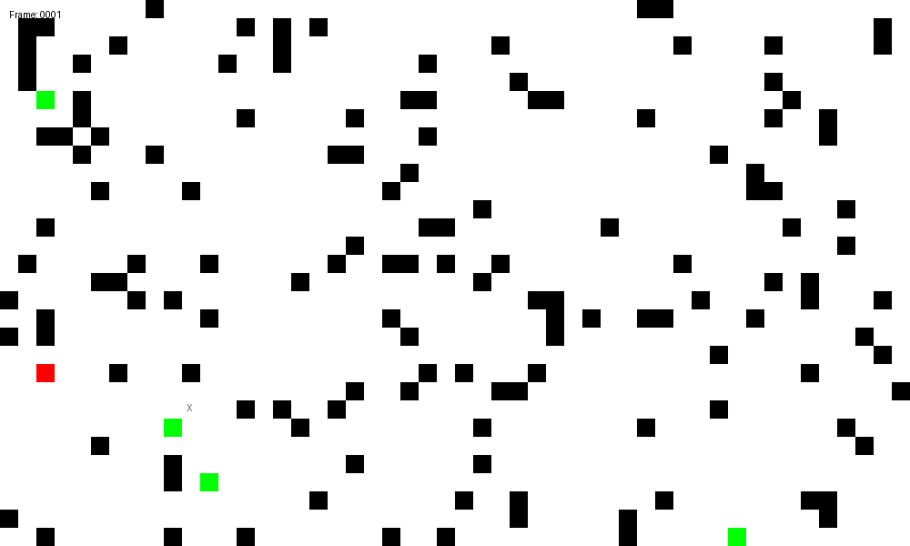

# 🚀 AeroSwarm - Parallel Drone Swarm Simulator


[](LICENSE)


  <!-- Your generated GIF here -->

> **Note**: If the GIF doesn't animate on GitHub, refresh the page or view it [directly](docs/drone_sim.gif).

A  C++ simulator for autonomous drone swarms with parallel pathfinding.


## ✨ Features
- **Parallelized terrain navigation** using `std::shared_mutex`
- **Obstacle avoidance** with probabilistic maps
- **Real-time visualization** (GIF generation)
- **Scalable architecture** for 1000+ drones


## 🧠 Swarm Exploration Algorithm

Target-Finding Without Prior Knowledge

Your drones use a multi-phase exploration strategy combining:

1. 🕵️ Decentralized Probing

Each drone autonomously explores using:

```c++
while not target_found:
    neighbors = get_adjacent_cells()
    next_pos = select_least_visited(neighbors)
    move_and_mark_visited(next_pos)
```
### 2. 📊 Adaptive Heuristics

Drones prioritize:

    - Least-Visited Cells:
    ```math
    P_{visit} = \frac{1}{visit\_count + 1}
    ```
    - High Information Gain:
        - Cells with more unvisited neighbors get higher priority
        - score = number_of_unexplored_adjacent_cells

### 3. 🔀 Emergent Coordination
    - No direct communication between drones
    - Implicit coordination via shared terrain markings (Cell::Visited)
    - Parallel exploration through thread-safe position updates

### 4. 🎯 Target Discovery

    - Drones only recognize the target when physically adjacent
    - First drone to reach the target terminates the simulation

## 🛠️ Build
```bash
mkdir build && cd build
cmake ..
make
./AeroSwarm 
``` 

## 📊 Example Output
```
Iteration: 90
Iteration: 91
Iteration: 92
🎯 Drone #0 found the target at (20,2)
```


## 🚀 **Future Roadmap & Call for Collaborators**  
**Let’s make this swarm smarter together!**  

### 🔮 **Planned Upgrades**  
| Area           | Cool Ideas                                                                 |
|----------------|---------------------------------------------------------------------------|
| **AI**         | Add ML-based path prediction (CNN/LSTM)                                   |
| **Physics**    | Real drone dynamics (acceleration, battery drain)                         |
| **Visuals**    | 3D WebGL visualization (via Three.js)                                    |
| **Game Mode**  | Competing swarms with resource collection                                |
| **Benchmarks** | Compare algorithms (A* vs RRT vs Swarm)                                  |

### 🤝 **Join the Fun!**  
We welcome:  
```diff
+ C++ enthusiasts  + Python wrappers   + ML engineers  
+ ROS integrators  + UI designers      + Algorithm nerds
```

**How to contribute:**  
1. Fork → Hack → PR  
<!--- 2. Claim an issue from our [Good First Issues](link-to-issues)  --->
2. Chat with us on [Discord](https://discord.gg/GsWAKpm2)  


## 📜 License

MIT License - Free for research and commercial use.


